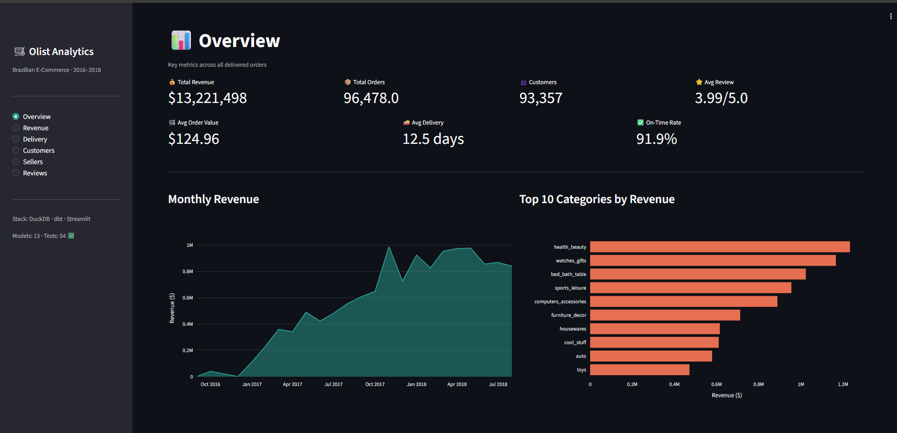
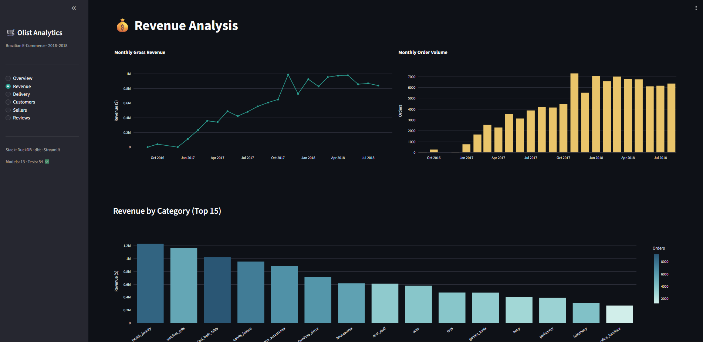
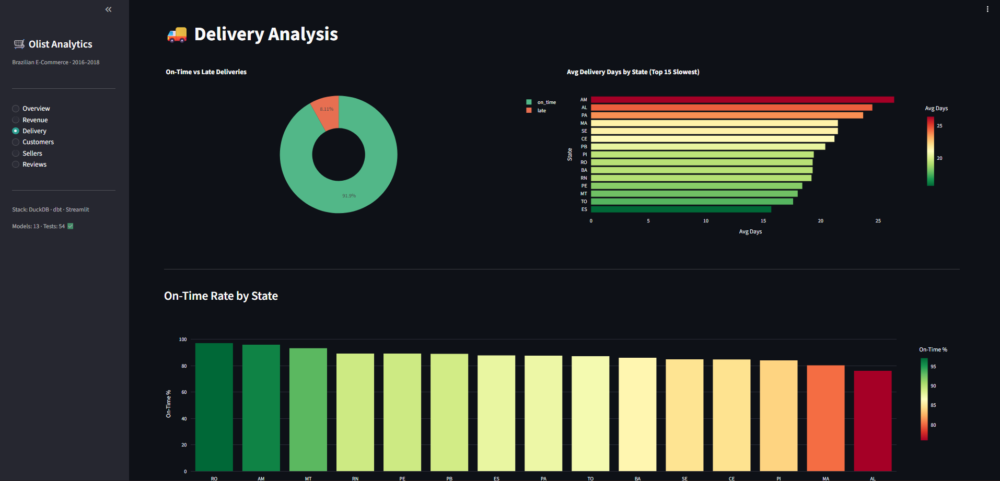
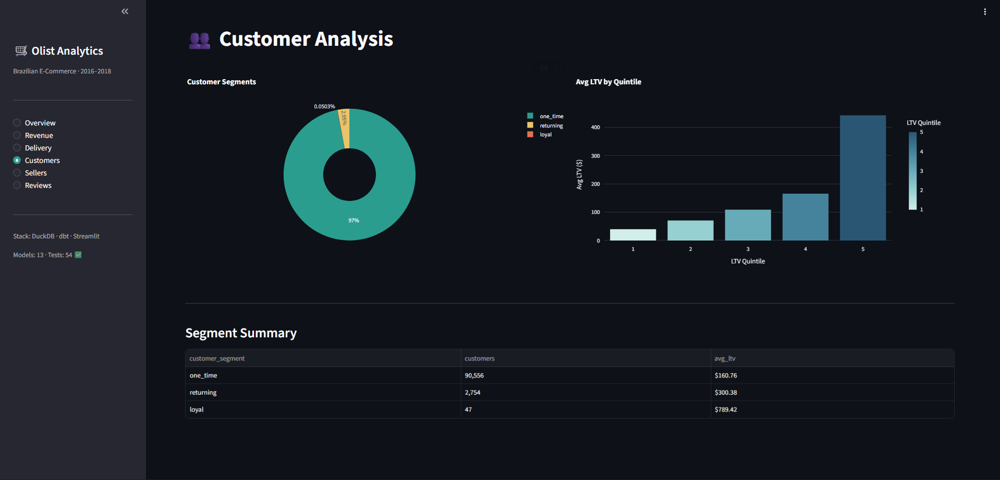
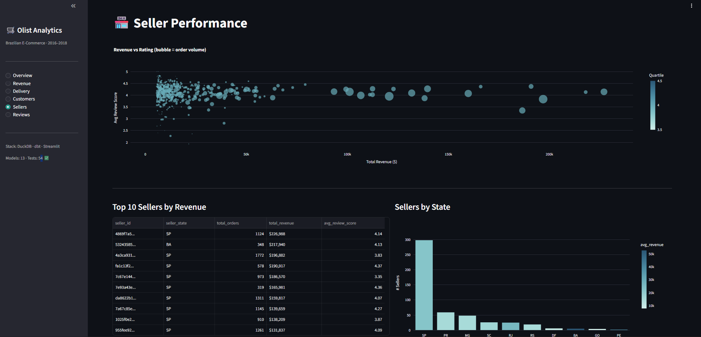
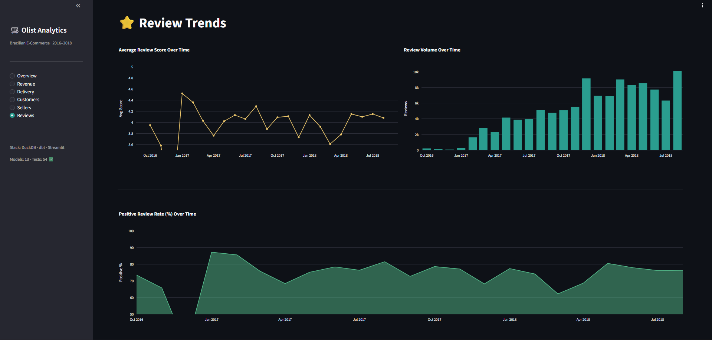

# 97% of Customers Never Come Back

### An Analytics Engineering Deep Dive into Brazilian E-Commerce


[](https://evgeniimatveevusa-olist-analytics.hf.space)

100,000+ orders. 9 raw tables. 13 dbt models. 54 data quality tests. One uncomfortable truth about Brazilian e-commerce retention.

**[Live Dashboard → HuggingFace Spaces](https://evgeniimatveevusa-olist-analytics.hf.space)**

---

## The Business Problem

Olist is a Brazilian marketplace that connects small businesses to major e-commerce channels. Between 2016 and 2018, it grew from zero to $1M/month in gross revenue — a textbook hyper-growth story.

But the retention numbers tell a different story. I built a full dbt + DuckDB analytics stack on top of their public dataset to find out what was actually driving — and limiting — the business.

---

## What the Data Shows

**Retention is near zero — and that's the core problem**

97% of Olist customers placed exactly one order and never returned. In a business where CAC is non-trivial and delivery costs are high, this means nearly every dollar of revenue came from acquiring a new customer rather than keeping an existing one. Avg order value ($124.96) has to carry the entire unit economics.

**Delivery time is a competitive liability in the Amazon region**

The national on-time delivery rate looks healthy at 91.9%. But break it down by state and the picture fractures. Amazonas (AM) averages 25+ days per delivery — nearly double the national average. SP (São Paulo) delivers in under 8 days. That's not a logistics challenge, it's a two-tier product experience baked into geography.

**The 91.9% headline hides where the 8.1% actually lives**

Late deliveries cluster in the North and Northeast — the same states with the lowest review scores. The correlation isn't subtle. Reviews aren't a proxy for product quality; they're a proxy for whether the package arrived when promised.

**Health & beauty outperforms every other category**

Not electronics. Not furniture. Health & beauty drove the highest gross revenue and the highest review scores simultaneously. The best-selling category is also the best-reviewed one — which means Olist's biggest growth lever is also its strongest moat.

**Revenue grew $0 → $1M/month in 18 months, then plateaued**

The monthly revenue curve rises steeply through 2017 and flattens in mid-2018. Without retention, growth requires constant new customer acquisition — and that ceiling arrives faster than the headline numbers suggest.

---

## At a Glance

| Metric | Value |
|--------|-------|
| Gross revenue | **$13,221,498** |
| Delivered orders | **96,478** |
| Unique customers | **93,357** |
| Avg order value | **$124.96** |
| One-time customers | **97%** |
| On-time delivery rate | **91.9%** |
| Avg delivery time | **12.5 days** |
| Slowest state | **AM → 25+ days avg** |
| Top revenue category | **health_beauty** |
| Avg review score | **3.99 / 5.0** |
| Revenue growth | **$0 → $1M/month in 18 months** |

---

## Screenshots

<details>
<summary>📊 Overview — KPI Cards & Revenue Trend</summary>



</details>

<details>
<summary>💰 Revenue — Monthly Timeline & Top Categories</summary>



</details>

<details>
<summary>🚚 Delivery — On-Time Rate & State Analysis</summary>



</details>

<details>
<summary>👥 Customers — LTV Segments & Quintiles</summary>



</details>

<details>
<summary>🏪 Sellers — Performance Scatter & Rankings</summary>



</details>

<details>
<summary>⭐ Reviews — Score Trends & Volume</summary>



</details>

---

## How the Data Model Works

The analysis runs on a two-layer dbt project: staging cleans and types the raw CSVs, marts apply the business logic. Every mart answers a specific business question.

```
raw.raw_orders ──────────────┐
raw.raw_customers ───────────┤──► stg_orders ──────────────┐
raw.raw_order_items ─────────┤──► stg_customers ───────────┤──► mart_revenue
raw.raw_order_payments ──────┤──► stg_order_items ─────────┤──► mart_delivery_analysis
raw.raw_order_reviews ───────┤──► stg_order_payments ──────┤──► mart_customer_ltv
raw.raw_products ────────────┤──► stg_order_reviews ───────┤──► mart_seller_performance
raw.raw_sellers ─────────────┤──► stg_products ────────────┤──► mart_reviews
raw.raw_geolocation ─────────┘──► stg_sellers
raw.raw_category_translation ───► stg_geolocation
```

| Mart | Business Question |
|------|------------------|
| `mart_revenue` | Which categories and periods drove growth? |
| `mart_delivery_analysis` | Where does delivery performance break down? |
| `mart_customer_ltv` | What does the retention curve actually look like? |
| `mart_seller_performance` | Which sellers deliver revenue and ratings? |
| `mart_reviews` | Does delivery time predict review score? |

**54 data quality tests — all passing:**
`not_null` on every key field · `unique` on all primary keys · `accepted_values` on status columns

---

## The Pipeline

```
Kaggle CSVs (9 files · 1.5M rows)
        ↓  Python ingestion (scripts/load_raw.py)
   DuckDB — raw schema
        ↓  dbt run
   staging/ — 8 views, cleaned + typed
        ↓  dbt run
   marts/ — 5 tables, business logic
        ↓  dbt test (54 assertions, all pass)
   Dashboard — Streamlit + Plotly (6 pages)
        ↓  Docker
   HuggingFace Spaces
```

| Layer | Tool |
|-------|------|
| Raw data | Kaggle — Olist Brazilian E-Commerce (public) |
| Database | DuckDB 1.5.3 (embedded) |
| Transformation | dbt-core 1.8 + dbt-duckdb adapter |
| Data quality | 54 dbt tests — `not_null`, `unique`, `accepted_values` |
| Dashboard | Streamlit + Plotly (6 pages) |
| Containerization | Docker + Docker Compose |
| Deployment | HuggingFace Spaces (Docker SDK) |

---

## Run It

### Docker

```bash
git clone https://github.com/evgeniimatveev/olist-e-commerce-analytics.git
cd olist-e-commerce-analytics
# Place Kaggle CSVs in data/ first
docker compose up --build
```
Open **http://localhost:8501**

### Python

```bash
git clone https://github.com/evgeniimatveev/olist-e-commerce-analytics.git
cd olist-e-commerce-analytics
pip install duckdb --only-binary=:all:
pip install -r requirements.txt
python scripts/load_raw.py       # CSVs → DuckDB
dbt run --profiles-dir .         # raw → staging → marts
dbt test --profiles-dir .        # 54 quality checks
python -m streamlit run dashboard/app.py
```

**Need the data?** Search `"olist brazilian ecommerce"` on Kaggle — 9 CSVs, all public.

---

## Project Structure

```
olist-dbt-duckdb/
├── models/
│   ├── staging/         # 8 views — stg_orders, stg_customers, ...
│   └── marts/           # 5 tables — revenue, delivery, ltv, sellers, reviews
├── scripts/
│   └── load_raw.py      # CSV → DuckDB ingestion
├── dashboard/
│   ├── app.py           # Streamlit (6 pages)
│   └── db.py            # DuckDB query layer
├── dbt_project.yml
├── profiles.yml
├── Dockerfile
└── docker-compose.yml
```

---

## Raw Data

| Table | Rows | What it contains |
|-------|------|-----------------|
| `raw_orders` | 99,441 | Order lifecycle and status timestamps |
| `raw_order_items` | 112,650 | Line items — price, freight, seller ID |
| `raw_order_payments` | 103,886 | Payment type, installments, value |
| `raw_order_reviews` | 99,224 | Customer ratings and text |
| `raw_customers` | 99,441 | Customer zip codes and states |
| `raw_products` | 32,951 | Product catalog and categories |
| `raw_sellers` | 3,095 | Seller locations |
| `raw_geolocation` | 1,000,163 | Zip code → lat/lng |
| `raw_category_translation` | 71 | Portuguese → English category names |

---

*Olist Brazilian E-Commerce · Kaggle public dataset · 2016–2018 · Built by Evgenii Matveev*
